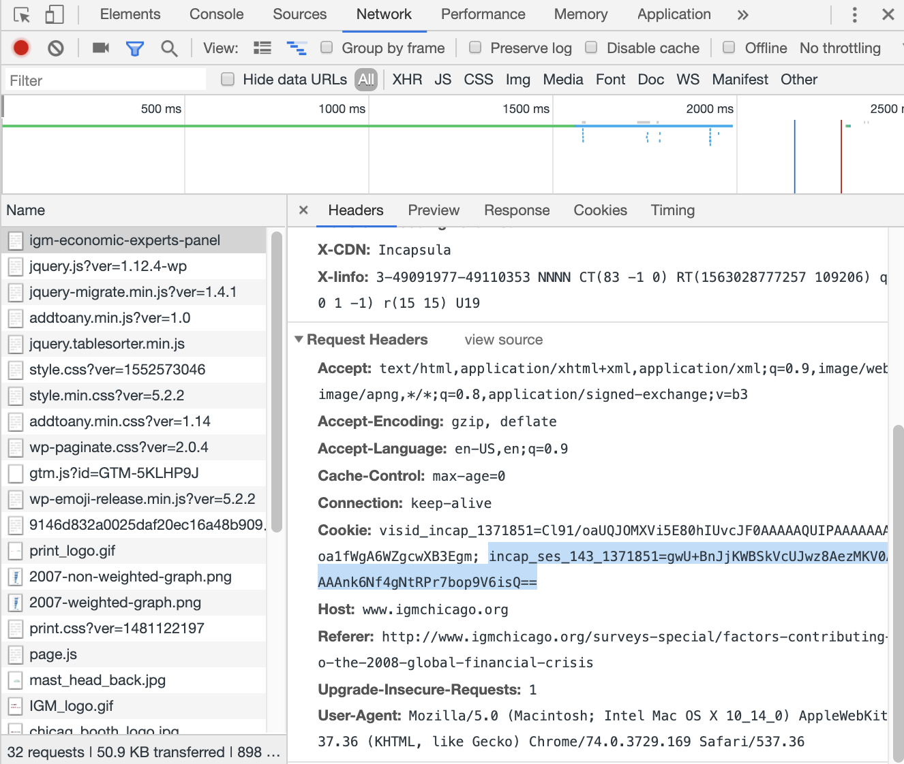

# IGM Panel Web Scraper

IGM Panel Scraper is a web scraper that pulls data from the IGM Economic Experts Panel at `http://www.igmchicago.org/igm-economic-experts-panel`

## Prerequisites
`node.js`

`npm`

Cookie from `http://www.igmchicago.org/igm-economic-experts-panel`

### How to get cookie
1. Go to `http://www.igmchicago.org/igm-economic-experts-panel`
2. Opening your browser dev tools
3. Navigate to the `network` tab
4. As shown in the follow screenshot, select the `igm-economic-experts-panel` request, and copy the cookie string beginning with `incap_ses`




## Running
```console
$ git clone <this repository>
$ cd <cloned dir>
$ node index.js <cookie>
```
File will be saved to the current directory as `igmdata.json`

## License

This project is licensed under the MIT License - see the [LICENSE](LICENSE) file for details

